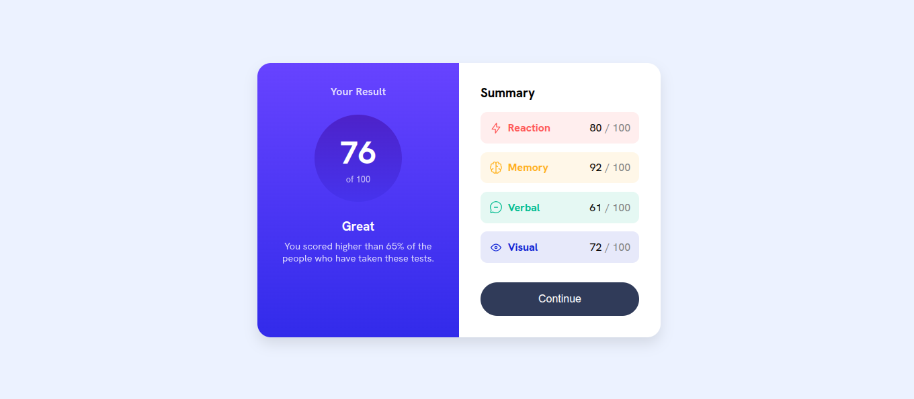

# Frontend Mentor - Results Summary Component Solution

This is my solution to the **Results Summary Component Challenge** on Frontend Mentor. The goal of this project was to build a responsive results summary card using semantic HTML and modern CSS techniques.

Frontend Mentor challenges help improve real-world frontend development skills by building practical UI components.

---

## 📑 Table of Contents

- [Overview](#overview)
  - [The Challenge](#the-challenge)
  - [Screenshot](#screenshot)
  - [Links](#links)

- [My Process](#my-process)
  - [Built With](#built-with)
  - [What I Learned](#what-i-learned)
  - [Continued Development](#continued-development)
  - [Useful Resources](#useful-resources)
  - [AI Collaboration](#ai-collaboration)

- [Author](#author)

---

# Overview

## The Challenge

Users should be able to:

- View the layout on **different screen sizes**
- See **clear visual hierarchy** for results and summary
- Experience **hover effects on interactive elements**
- Read data in a clean and structured format

This challenge focuses on:

- Layout design using CSS Grid
- Styling with gradients and colors
- Responsive UI design
- Component structuring

---

## Screenshot

Add a screenshot of your final project here.

```md

```

---

## Links

- Solution URL: https://www.frontendmentor.io/solutions/results-summary-component-challenge-rFypSpXCoo
- Live Site URL: https://studywithmunir.github.io/Results-Summary/

---

# My Process

## Built With

- **Semantic HTML5**
- **CSS3**
- **CSS Grid**
- **Flexbox**
- **Google Fonts**
- **Responsive design**

Font used:

- Hanken Grotesk

---

## What I Learned

This project helped me strengthen my understanding of layout and UI design.

### Using CSS Grid for Layout

The main container uses CSS Grid to create a two-column layout.

```css
.results-summary-container {
  display: grid;
  grid-template-columns: 1fr 1fr;
}
```

### Creating Gradient Backgrounds

Gradients were used to enhance the visual appearance of the score section.

```css
.score-container {
  background: linear-gradient(#6743ff, #322bea);
}
```

### Building a Circular Score Component

A circular design was created using equal width and height with border-radius.

```css
.result {
  border-radius: 50%;
  width: 130px;
  height: 130px;
}
```

### Responsive Design

The layout switches to a single column on smaller screens.

```css
@media (max-width: 600px) {
  .results-summary-container {
    grid-template-columns: 1fr;
  }
}
```

---

## Continued Development

In future projects, I want to focus on:

- Writing more **maintainable CSS**
- Improving **UI design consistency**
- Learning advanced **layout techniques**
- Using **CSS variables** for better theming

---

## Useful Resources

- Frontend Mentor
  https://www.frontendmentor.io/

- MDN Web Docs
  https://developer.mozilla.org/

These resources helped me better understand CSS layout and styling techniques.

---

## AI Collaboration

AI tools were used during this project to assist with:

- Debugging layout issues
- Improving CSS structure
- Writing clean documentation

Tool used:

- ChatGPT

AI helped speed up development while allowing me to focus on learning and implementation.

---

# Author

- Frontend Mentor: https://www.frontendmentor.io/profile/StudywithMunir
- GitHub: https://github.com/StudywithMunir/Results-Summary
